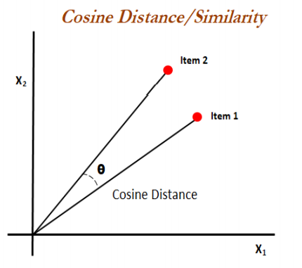

# Quora Question Pairing system
### Mernstack Machine Learning Application

Fullstack web based machine learning application which tells if the two input/selected questions have similar meaning/intent.

#### Features:
* Given two input questions the app predicts if the have same meaning/intent.
* The two input questions will be stored in the MongoDB database.
* The questions in the database will be rendered in the UI.
* Form the given list of questions user can select any two questions and can ask to predict for the same and it will give the response accordingly.

### Technologies used:

* Frontend:- `React.js` and `Material UI`
* Backend: - `Nodejs`, `Express.js`, `MongoDB`
* Machine Learning:- `Python`, `Ensemble Learning Algorithms`, `Data Analysis`

#### How this application works:
* On submitting the two input questions it gets stored in the database using the `post()` method.
* Simultaneously those questions gets passed as parameter to the python script.
* Python script on the server processes the input and gives the predicted result.
* The predicted result gets rendered in the UI.
* And the questions in the database fetched from the database using `get()` method to re-render in the UI.
* If the user opts to select any two questions from the rendered list then those selected questions is passed to the server side to process. 
* After processing the result is displayed on the UI.

To run the python script on server side I have used Nodejs' `child_process()` method.

#### Now Machine Learning part:
* Dataset is taken from [Kaggle](https://www.kaggle.com/c/quora-question-pairs)
* The final training data was prepared after doing some cleaning(removing punctuation, stemming, lemmatisation, etc) and preprocessing(cosine similarity, polarity, question length, etc). 
* I have used python's `nltk` library to do the preprocessing.
* Feature Engineering: to generate features out of the cleaned and preprocessed data.
* To train the model I have use lightGBM, RandomForest and XGBoost algorithm. And out of all three XGBoost performs best.
* So, XGBoost model was selected as the final for prediction.
* Model evaluation metric: Log Loss. Log loss from XGBoost 0.428

##### How Cosine Similarity works:
Cosine similarity is a metric used to measure how similar the documents are irrespective of their size. Mathematically, it measures the cosine of the angle between two vectors projected in a multi-dimensional space. The cosine similarity is advantageous because even if the two similar documents are far apart by the Euclidean distance (due to the size of the document), chances are they may still be oriented closer together. The smaller the angle, higher the cosine similarity.

To read more click [here](https://www.machinelearningplus.com/nlp/cosine-similarity/)

  

##### How Polarity works:
Polarity analysis takes into account the amount of positive or negative terms that appear in a given sentence. It is useful to some extent, since it does a good job of structuring data sets.
If two questions have different polarity they have more chances of being different or vice-versa.

To read more click [here](https://www.quora.com/What-is-polarity-and-subjectivity-in-sentiment-analysis).

##### To run this project on your machine:
* Clone this repository to your local machine.
* Make sure you have `node >= v14.15.3` installed.
* To install the dependencies run `npm install` .
* run the above command in the backend folder too.
* Now to start server run `nodemon server` in he backend folder.
* To start app run `npm start`.
* To run the python script you must have `python >= 3.7` installed.
* Make sure your server is running before asking the app to predict.

